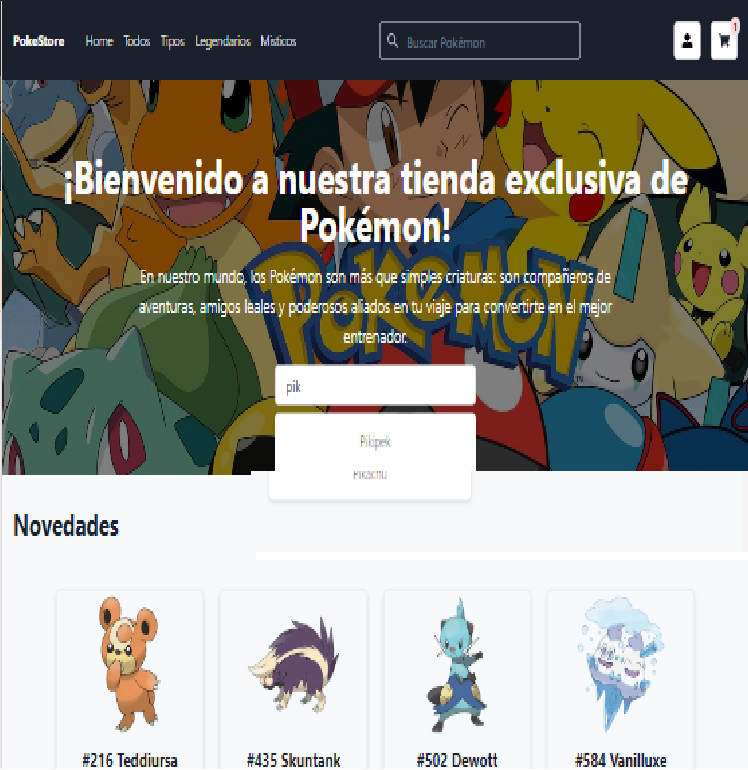
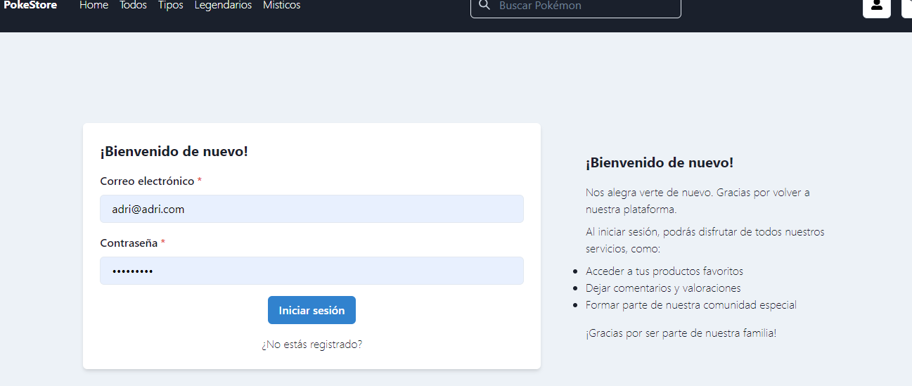
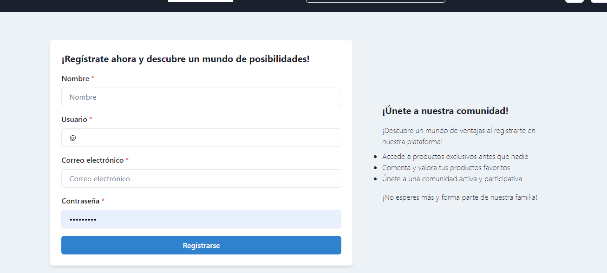
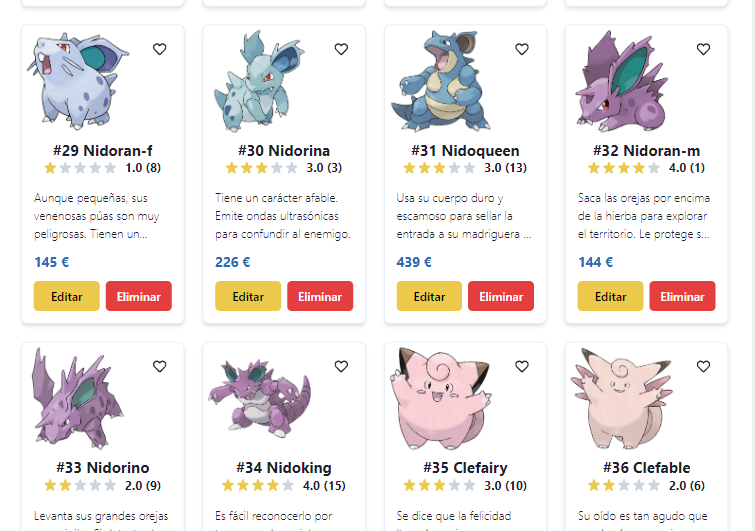
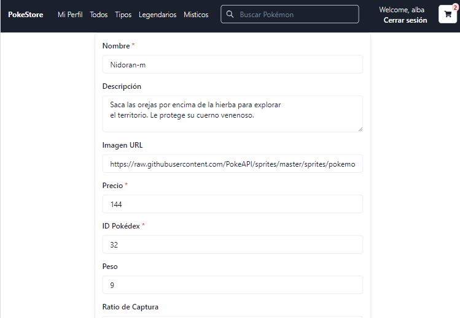
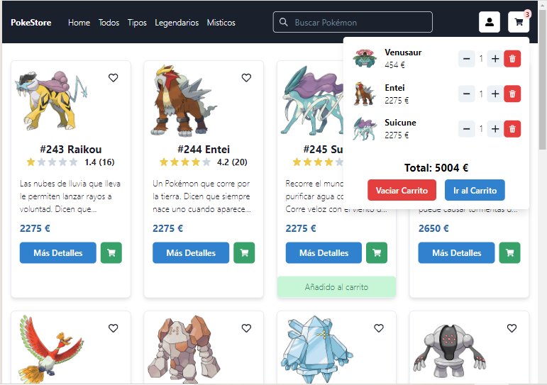
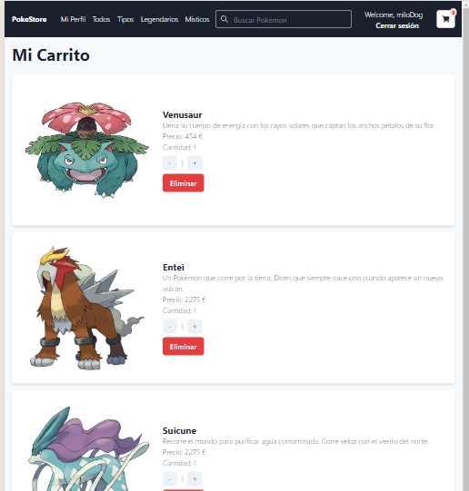
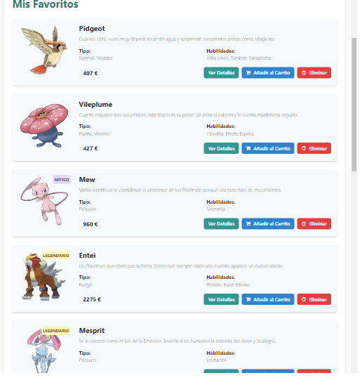
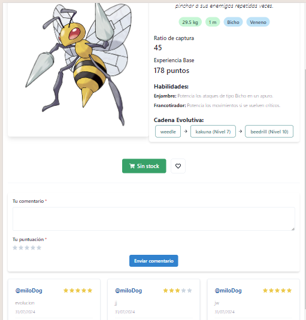

# PokeStore

PokeStore is an e-commerce platform for purchasing Pokémon-related products. The platform allows users to browse and purchase various Pokémon items, manage their wishlist, and leave product reviews. It also includes an admin interface for managing products and orders.




## Table of Contents

- [Features](#features)
- [Technologies Used](#technologies-used)
- [Installation](#installation)
- [Usage](#usage)
- [Project Structure](#project-structure)
- [Environment Variables](#environment-variables)
- [Contributing](#contributing)
- [License](#license)
- [Contact](#contact)
- [Screenshots](#screenshots)

## Features

- **User Authentication**: Users can sign up, log in, and manage their profiles.


- **Product Management**: Admins can add, edit, and delete products.


- **Shopping Cart**: Users can add products to their cart and proceed to checkout.


- **Wishlist**: Users can add products to their wishlist.


- **Product Reviews**: Users can leave ratings and comments on products.


- **Responsive Design**: The platform is optimized for both desktop and mobile devices.

## Technologies Used

- **Frontend**:
  - React
  - Chakra UI
  - React Router
  - Context API for state management


- **Backend**:
  - Node.js
  - Express
  - MongoDB
  - Mongoose
  - Firebase 


- **Others**:
  - ESLint for code linting
  - Prettier for code formatting
  - Chat Gpt
  - Claude Ia

## Installation

To run this project locally, follow these steps:

### Prerequisites

- Node.js and npm installed on your machine
- MongoDB instance running locally or remotely

### Clone the Repository

```bash
git clone https://github.com/canosa92/PokeStore-project.git
cd PokeStore-project
